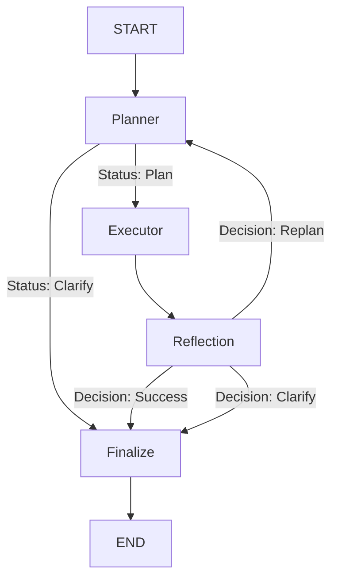

# Agentic RAG Subgraph

Welcome to the Agentic RAG subgraph. This module represents the core retrieval intelligence of the application, built using LangGraph.

Traditional RAG systems typically operate in a straight line: they take a user query, perform a vector search, and return the top results. While effective for simple questions, this linear approach struggles with complex queries that require fetching data from multiple sources or adjusting the search strategy on the fly. 

To solve this, we designed an "Agentic" RAG architecture. Instead of a fixed pipeline, we use a Large Language Model to dynamically plan the retrieval process, execute it efficiently, evaluate the results, and self-correct if necessary.

---

## How It Works: The High-Level Workflow

Think of this system as a team of three specialized workers collaborating to answer a user's question:

1. **The Planner (The Architect)**  
   When a question comes in, the Planner analyzes it and writes a step-by-step execution plan. It decides exactly which databases to query and in what order. If the question is too ambiguous, the Planner can immediately pause and ask the user for clarification.

2. **The Executor (The Engine)**  
   The Executor receives the plan and runs the required tools. To ensure maximum speed, it doesn't just run them one by one. It understands which steps depend on others and executes independent steps simultaneously.

3. **The Reflection Node (The Reviewer)**  
   Once the tools finish running, the Reflection node reviews the gathered information. It asks: *Did we actually find the answer to the user's question?* 
   - If yes, the process completes successfully.
   - If no (perhaps a database search returned zero results), it sends the system back to the Planner for a "Replan", suggesting a different search strategy.

### Workflow Visualization

---

## Deep Dive: Technical Architecture

Under the hood, this system is engineered for high performance, strict type safety, and fault tolerance. Here is a closer look at the technical implementation.

### Dynamic DAG Generation
The Planner does not output a simple list of steps; it generates a Directed Acyclic Graph (DAG). Using strict Pydantic v2 parsers, the LLM constructs `PlanStep` objects that explicitly define their dependencies (`depends_on`). This ensures the orchestrator understands the exact topological order required for execution.

### Deterministic Asynchronous Execution
The Executor node is a custom-built asynchronous engine. It evaluates the DAG in real-time, identifying "Ready Steps" whose dependencies have already been met. It then utilizes `asyncio.gather` to execute these independent tools concurrently. This topological layering minimizes I/O bottlenecks when querying multiple databases.

### Advanced State Management and Variable Injection
Managing data flow between dynamically generated steps requires a robust state architecture. 
- **Flat State Tracking**: Instead of deeply nested and error-prone dictionaries, the system state utilizes a highly performant, flat `List[StepOutput]`. 
- **O(1) Resolution**: During execution, the engine builds a transient dictionary to achieve O(1) lookups. This enables instant resolution of cross-step variables (e.g., passing `$step_1.lecture_id` into step 2) and global runtime variables (like `$student_id`).
- **Clean Injection**: The execution engine autonomously injects the `step_id` directly into the underlying tool arguments, ensuring complete traceability across the stack.

### Self-Healing and Graceful Failures
Traditional systems crash or return empty responses when a database query fails. This architecture is designed to self-heal.
- When a tool encounters an issue (e.g., a missing record), it does not throw an exception. Instead, it returns a graceful `FailureInfo` object.
- The Reflection node detects this failure and issues a `replan` decision.
- Crucially, the system preserves the failed attempts by migrating the current outputs into a historical context (`history`). The Planner then reads this history, understands what went wrong, and formulates a new, alternative retrieval plan.

---

## The Retrieving Layer

The tools available to the Planner are strictly typed, modular, and categorized by their underlying data source:

- **Vector Database (`vdb/`)**: Handles semantic and similarity searches (e.g., Chroma/Qdrant). Includes logic for applying relevance thresholds to ensure high-quality context.
- **Operational Database (`mongo/`)**: Fetches massive, unstructured JSON documents like full lecture transcripts or pre-computed summaries.
- **Relational SQL (`sql/`)**: Queries structured user data. This layer includes a specialized LLM-powered `NameResolver` that fuzzily matches natural language terms from the user (e.g., a misspelled course name) against exact primary keys in the database before executing the query.
