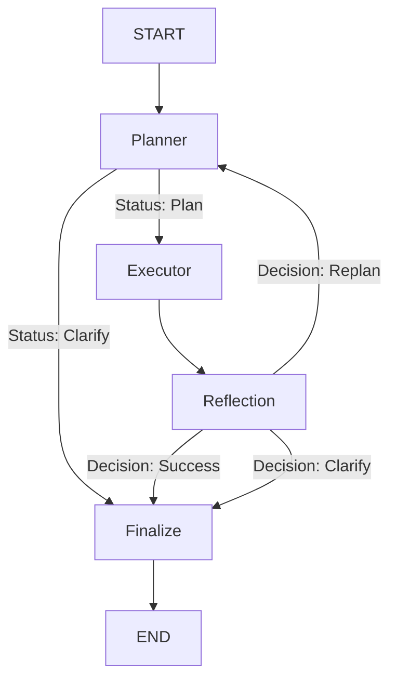

# Agentic RAG Subgraph

Welcome to the Agentic RAG subgraph. This module represents the core retrieval intelligence of the application, built using LangGraph.

Traditional RAG systems typically operate in a straight line: they take a user query, perform a vector search, and return the top results. While effective for simple questions, this linear approach struggles with complex queries that require fetching data from multiple sources or adjusting the search strategy on the fly. 

To solve this, we designed an "Agentic" RAG architecture. Instead of a fixed pipeline, we use a Large Language Model to dynamically plan the retrieval process, execute it efficiently, evaluate the results, and self-correct if necessary.

---

## How It Works: The High-Level Workflow

Think of this system as a team of three specialized workers collaborating to answer a user's question:

1. **The Planner (The Architect)**  
   When a question comes in, the Planner analyzes it and writes a step-by-step execution plan. It decides exactly which databases to query and in what order. If the question is too ambiguous, the Planner can immediately pause and ask the user for clarification.

2. **The Executor (The Engine)**  
   The Executor receives the plan and runs the required tools. To ensure maximum speed, it doesn't just run them one by one. It understands which steps depend on others and executes independent steps simultaneously.

3. **The Reflection Node (The Reviewer)**  
   Once the tools finish running, the Reflection node reviews the gathered information. It asks: *Did we actually find the answer to the user's question?* 
   - If yes, the process completes successfully.
   - If no (perhaps a database search returned zero results), it sends the system back to the Planner for a "Replan", suggesting a different search strategy.

### Workflow Visualization

---

## Nodes

### Planner (`temp=0.1`)
Receives the user query + execution history + reflection feedback and outputs a `PlannerOutput`:
- `status="plan"` with a list of `PlanStep` objects (each with `id`, `tool_name`, `args`, `depends_on`)
- `status="clarification"` with a question to send back to the user

The `depends_on` field is what makes this a DAG — step_2 can depend on step_1's output and reference it as `$step_1.lecture_id`.

The Planner also enforces course scope: if the query references a course the student is not enrolled in, it returns a clarification instead of a plan.

### Executor
No LLM. Pure async execution engine:
1. Reads the DAG from `PlannerOutput.steps`
2. Resolves variable references (`$step_1.key`, `$student_id`) at runtime via O(1) dict lookup
3. In each iteration: collects all steps whose `depends_on` are already satisfied → `asyncio.gather` runs them concurrently
4. On any tool failure: writes a `FailureInfo` to the `StepOutput` and breaks early for Reflection to handle
5. Injects `step_id` into each tool call for full traceability

### Reflection (`temp=0.0`)
Classifies whether the retrieved `step_outputs` are sufficient to answer the user:
- `success` — the tool returned the requested type of content (even if it looks like test data)
- `replan` — outputs were missing or tools failed; includes a reason the Planner will use to adjust strategy
- `clarification` — the query is ambiguous and needs user input

On `replan`, the current `step_outputs` are merged into `previous_attempts` so the Planner can see the full failure history across all attempts.

### Finalize
No LLM. Aggregates `previous_attempts + step_outputs`, extracts text from each `StepOutput.content` (handling `chunks` with metadata, `summary`, `text`, and raw JSON fallback), and returns a `RAGSubgraphOutput` with `retrieved_context`, `run_step_outputs`, `status`, and optional `clarification_question` or `error_message`.

---

## State

`RAGSubgraphState` holds:
- `user_query`, `student_id`, `student_courses`, `messages_history`
- `previous_steps_outputs` — step outputs from **past turns** (passed in from the main graph)
- `previous_attempts` — step outputs from **earlier replanning attempts within this turn**
- `step_outputs` — outputs from the **current execution round**
- `planner_output`, `reflection_decision`, `replan_count`
- `retriving_results` — the final `RAGSubgraphOutput` written by Finalize

---

## Tools

Tools are registered by name in `RAGSubgraph.__init__` and described to the Planner via `tools_registry.py`. Three source categories:

| Source | Tools |
|---|---|
| Vector DB (Qdrant) | `ask_in_specific_lecture_by_lecture_id`, `ask_in_the_whole_course_by_course_id`, `search_in_sessions_history`, `ask_in_legal_regulations` |
| MongoDB | `get_lecture_whole_content_by_lecture_id`, `get_lecture_summary_by_lecture_id` |
| SQL | `get_lecture_id_by_lecture_name`, `get_course_details_by_course_id`, `get_all_course_lectures_by_course_id` |

The SQL layer includes an LLM-powered name resolver that fuzzy-matches natural language lecture/course names to exact database IDs before executing the query.

---

## LLM Map

Built inside `RAGSubgraph.__init__` from the passed `lc_openai_client`:

| Key | Temperature | Reason |
|---|---|---|
| `planner` | 0.1 | Needs structured DAG output — slight flexibility for plan creativity |
| `reflection` | 0.0 | Binary classification — must be deterministic |
