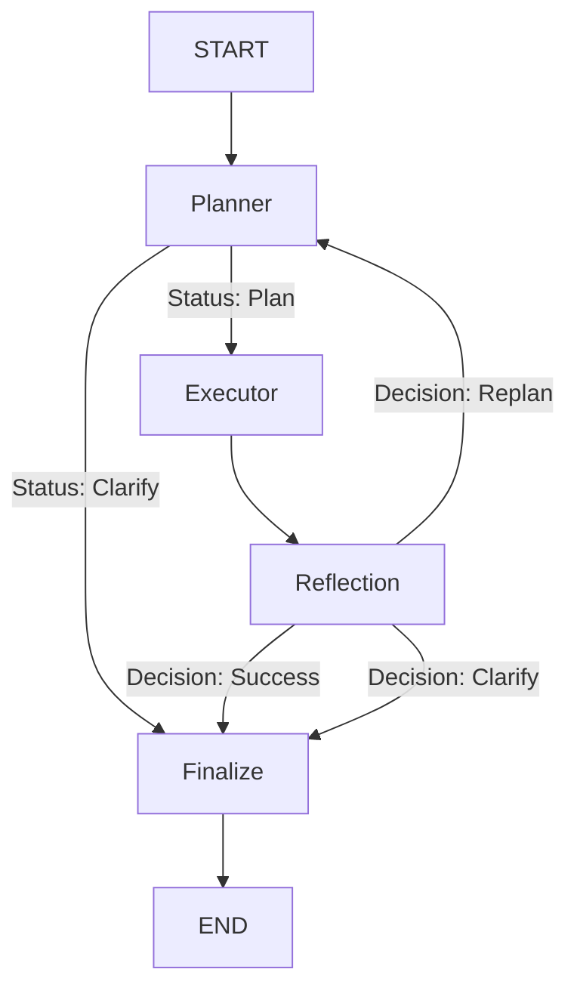

# Agentic RAG Subgraph

This module represents the core retrieval intelligence of the application, built using LangGraph.

Traditional RAG systems typically operate in a straight line: they take a user query, perform a vector search, and return the top results. While effective for simple questions, this linear approach struggles with complex queries that require fetching data from multiple sources or adjusting the search strategy on the fly. 

To solve this, we designed an Agentic RAG architecture. Instead of a fixed pipeline or sequential tool-calling loop, we use a Large Language Model to dynamically plan the retrieval process, execute tools concurrently, evaluate the results, and self-correct when necessary.

---

## How It Works: The High-Level Workflow

Think of this system as a team of three specialized workers collaborating to answer a user's question:

1. **The Planner**  
   When a question comes in, the Planner analyzes it and writes a step-by-step execution plan. It decides exactly which databases to query and in what order. If the question is too ambiguous, the Planner can immediately pause and ask the user for clarification.

2. **The Executor**  
   The Executor receives the plan and runs the required tools. To ensure maximum speed and avoid sequential tool-calling bottlenecks, it executes independent steps concurrently using Python's asyncio.gather. It understands which steps depend on others and resolves dependencies at runtime.

3. **The Reflection Node**  
   Once the tools finish running, the Reflection node reviews the gathered information. It asks: Did we actually find the answer to the user's question? 
   - If yes, the process completes successfully.
   - If no (perhaps a database search returned zero results), it sends the system back to the Planner for a Replan, suggesting a different search strategy.

### Workflow Visualization

---

## Nodes

### Planner (temp=0.1)
Receives the user query + execution history + reflection feedback and outputs a PlannerOutput:
- status="plan" with a list of PlanStep objects (each with id, tool_name, args, depends_on)
- status="clarification" with a question to send back to the user

The depends_on field is what makes this a DAG — step_2 can depend on step_1's output and reference it as $step_1.lecture_id.
The Planner also enforces course scope: if the query references a course the student is not enrolled in, it returns a clarification instead of a plan.

### Executor
No LLM. Pure async execution engine:
1. Reads the DAG from PlannerOutput.steps
2. Resolves variable references ($step_1.key, $student_id) at runtime via dictionary lookup
3. In each iteration: collects all steps whose depends_on are already satisfied and runs them concurrently using asyncio.gather (parallel multitasking)
4. On any tool failure: writes a FailureInfo to the StepOutput and breaks early for Reflection to handle
5. Injects step_id into each tool call for full traceability

### Reflection (temp=0.0)
Classifies whether the retrieved step_outputs are sufficient to answer the user:
- success: the tool returned the requested type of content
- replan: outputs were missing or tools failed; includes a reason the Planner will use to adjust strategy
- clarification: the query is ambiguous and needs user input

On replan, the current step_outputs are merged into previous_attempts so the Planner can see the full failure history across all attempts.

### Finalize
No LLM. Aggregates previous_attempts + step_outputs, extracts text from each StepOutput.content (handling chunks with metadata, summary, text, and raw JSON fallback), and returns a RAGSubgraphOutput with retrieved_context, run_step_outputs, status, and optional clarification_question or error_message.

---

## Advanced Retrieval Techniques

The vector retrieval layer implements advanced search techniques to maximize context relevance:

- **Hybrid Search**: Combines semantic vector search (dense embeddings) and keyword-based search (BM25 sparse vectors) to leverage both conceptual semantics and exact keyword matches.
- **Reciprocal Rank Fusion (RRF)**: Merges sparse and dense search results using reciprocal rank scoring (using a formula of `1 / (60 + rank)`). A weighted combination (0.7 for semantic, 0.3 for keyword) is applied to produce a single deduplicated candidate list.
- **Cohere Cross-Encoder Reranking**: Integrates Cohere's advanced reranking model (`rerank-english-v3.0`) to re-score retrieved candidate documents against the original query, ensuring highly relevant passages are prioritized.
- **Query Rewriting and Multi-Query Expansion**: Uses an LLM-powered query expansion chain to generate multiple search variations from the user query. It retrieves context for all variations in parallel, fusing the results via RRF to capture multi-faceted intent.

---

## Student Persona and Session History

- **Student Persona**: Tracks student interaction history, query complexity, and knowledge levels cached dynamically in Redis. The persona is updated inline using an async tool callback and persisted back to MongoDB at session end to tailor responses.
- **Session History Search**: indexes past conversational turns semantically in Qdrant, enabling the retrieval node to reference historical session context across chat boundaries.

---

## Structure-Aware PDF Extraction

- **Azure AI Document Intelligence**: Parsed PDF lectures are extracted preserving structure, section headers, tables, and paragraphs. This structure-aware chunking ensures semantic context is maintained instead of relying on naive character-count cuts.

---

## State

RAGSubgraphState holds:
- user_query, student_id, student_courses, messages_history
- previous_steps_outputs: step outputs from past turns (passed in from the main graph)
- previous_attempts: step outputs from earlier replanning attempts within this turn
- step_outputs: outputs from the current execution round
- planner_output, reflection_decision, replan_count
- retriving_results: the final RAGSubgraphOutput written by Finalize

---

## Retrieval Tools

Tools are registered by name in RAGSubgraph.__init__ and described to the Planner via tools_registry.py. They pull from three primary database systems:

- **Vector Database (Qdrant)**:
  - ask_in_specific_lecture_by_lecture_id: Semantic search limited to a specific lecture file.
  - ask_in_the_whole_course_by_course_id: Semantic search covering all lectures within a course.
  - search_in_sessions_history: Semantic search over past chat session history.
  - ask_in_legal_regulations: Semantic search over legal and regulatory guides.

- **MongoDB Document Store**:
  - get_lecture_whole_content_by_lecture_id: Fetches full-text content of a lecture.
  - get_lecture_summary_by_lecture_id: Fetches lecture summaries.

- **SQL Server Relational Store**:
  - get_lecture_id_by_lecture_name: Resolves exact lecture ID via SQL querying.
  - get_course_details_by_course_id: Fetches metadata for a course.
  - get_all_course_lectures_by_course_id: Fetches all lecture listings for a course.

- **Fuzzy Name Resolver**: An LLM-powered utility that resolves natural language references to exact database primary keys prior to query execution.

---

## LLM Map

Built inside RAGSubgraph.__init__ from the passed lc_openai_client:

| Key | Temperature | Reason |
|---|---|---|
| planner | 0.1 | Needs structured DAG output — slight flexibility for plan creativity |
| reflection | 0.0 | Binary classification — must be deterministic |
