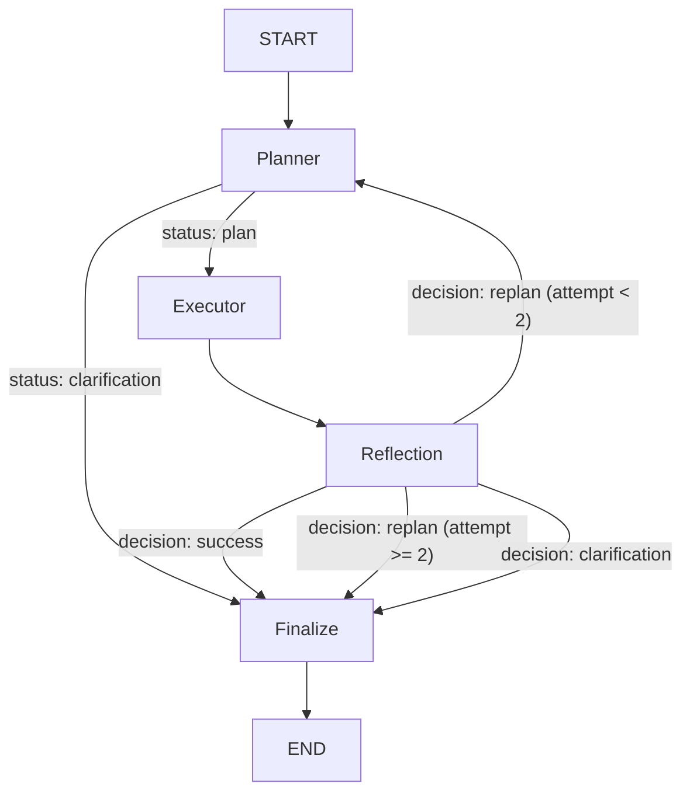

# Agentic RAG Subgraph

> The core retrieval intelligence of the Chatbot Service — a self-correcting, plan-then-execute retrieval engine built on LangGraph.

---

## The Problem with Standard Tool-Calling (`bind_tools`)

The conventional LangChain/LangGraph agent pattern uses `bind_tools` to give an LLM access to a set of tools. At runtime this creates a **React-style loop**:

```
LLM call → pick one tool → observe result → LLM call → pick one tool → ...
```

This design has three fundamental problems for a multi-source retrieval use case:

**1. N tools = N LLM calls for tool selection.**  
Every step requires a full LLM round-trip just to decide which tool to call next. For a question like "summarise lecture 3 of my Data Mining course", the system needs to: (a) resolve the course ID, (b) resolve the lecture ID from the name, and (c) fetch the summary. With `bind_tools`, that's 3 sequential LLM calls before a single byte of real content is retrieved.

**2. All tool results get re-tokenized on every LLM call.**  
Each intermediate tool result is injected back into the LLM's context for the next decision. As results accumulate, the prompt grows — consuming tokens and increasing cost on every iteration.

**3. No built-in recovery mechanism.**  
If a tool returns empty results, the standard loop has no way to reason about *why* it failed or try a meaningfully different strategy. It either returns nothing or halts.

---

## This Subgraph's Solution: Upfront DAG Planning

Instead of letting the LLM decide one tool at a time, the Planner node is invoked **once** and produces a complete, typed execution plan for the entire retrieval task — a list of `PlanStep` objects forming a DAG with explicit dependency declarations.

```python
# Example plan produced by a single Planner LLM call:
steps = [
    PlanStep(id="step_1", tool_name="get_lecture_id_by_lecture_name",
             args={"course_id": "IS422P", "lecture_name": "Chapter 3"},
             depends_on=[]),

    PlanStep(id="step_2", tool_name="ask_in_specific_lecture_by_lecture_id",
             args={"lecture_id": "$step_1.lecture_id", "query": "neural network architectures"},
             depends_on=["step_1"]),

    PlanStep(id="step_3", tool_name="search_in_sessions_history",
             args={"student_id": "$student_id", "query": "neural network architectures"},
             depends_on=[]),   # independent — runs in parallel with step_1
]
```

The Executor then walks this DAG **without any LLM involvement**:
- `step_1` and `step_3` have no dependencies → dispatched concurrently via `asyncio.gather`
- `step_2` depends on `step_1` → waits for its output, then resolves `$step_1.lecture_id` at runtime and executes

**The result:** the full plan costs **1 LLM call** (Planner) + **parallel async I/O** (Executor), regardless of how many tools are needed. Tool results live in the executor's state dictionary and are never re-injected into an LLM mid-execution.

### Direct Comparison

| | `bind_tools` React Loop | This Subgraph (Cyclic DAG) |
|---|---|---|
| **LLM calls for tool selection** | 1 per tool (N calls for N tools) | **1 total** (Planner emits full plan) |
| **Tool execution order** | Sequential, decided step-by-step | **Parallel** for independent steps via `asyncio.gather` |
| **Token cost per tool** | All prior results re-injected each LLM call | Tool results stay in state, never re-tokenized |
| **Dependency handling** | Implicit — LLM infers order from context | **Explicit `depends_on`** — deterministic, auditable |
| **Failure recovery** | No built-in mechanism | **Reflection node** triggers targeted replan with failure reason |
| **Variable passing** | LLM copies values between calls | **`$step_1.output_key`** resolved by path traversal at execution time |

---

## High-Level Workflow

The subgraph operates as a **cyclic state machine** with four nodes and two conditional branches:



### The Four Nodes at a Glance

| Node | Has LLM? | Role |
|---|---|---|
| **Planner** | ✅ (temp=0.1) | Converts the user query into a typed DAG of tool steps |
| **Executor** | ❌ | Resolves dependencies, runs tools concurrently via `asyncio.gather` |
| **Reflection** | ✅ (temp=0.0) | Classifies whether the retrieved data is sufficient |
| **Finalize** | ❌ | Aggregates all contexts, deduplicates, and emits the final output |

---

## Node Deep-Dives

### Planner Node (`temp=0.1`)

**File:** `nodes/planner.py`

The Planner is the brain of the subgraph. It receives the user query alongside the full execution history and uses structured output (`PlannerOutput` via `function_calling`) to produce one of two outcomes:

- **`status="plan"`**: A list of `PlanStep` objects, each carrying an `id`, `tool_name`, `args`, and a `depends_on` list. The `depends_on` field turns the flat list of steps into a DAG — `step_2` can declare it depends on `step_1`, and the Executor will honour that ordering.
- **`status="clarification"`**: A natural-language question to surface back to the user (e.g., when the course reference is ambiguous).

**Variable interpolation in args:** The Planner can embed references like `$step_1.lectures[0].id` directly inside step arguments. These are resolved at runtime by the Executor — the Planner never needs to know the actual values upfront.

**Scope enforcement:** The Planner's system prompt includes the student's enrolled courses. If the query references a course the student isn't enrolled in, the Planner outputs `status="clarification"` with a polite decline rather than attempting retrieval.

**Replan loop:** On each replanning cycle, the full history of failed attempts (from `past_attempts_tool_outputs`) and the Reflection node's failure reason are injected as a `[CRITICAL FEEDBACK]` block. The Planner is instructed to adjust its strategy accordingly and avoid repeating the same failing steps.

---

### Executor Node

**File:** `nodes/executer.py`

The Executor is a pure async execution engine — no LLM, no decisions. Its job is to faithfully run the DAG produced by the Planner.

**Algorithm (iterative topological execution):**

```
while steps_to_run is not empty:
    ready_steps = [s for s if all(s.depends_on are already satisfied)]
    results = await asyncio.gather(*[run(s) for s in ready_steps])
    if any result has a failure_info:
        break  # surface failure to Reflection immediately
    mark all results as executed
```

This means:
- Steps with no `depends_on` all run **in parallel** on the first iteration.
- A step that depends on another runs **only after** that dependency's output is written to `step_outputs_dict`.
- A tool crash or failure immediately halts the remaining queue and hands off to Reflection.

**Variable resolution:** Before calling each tool, the Executor resolves every `$`-prefixed argument using a path traversal parser. `$step_1.lectures[0].id` is parsed token-by-token (`.key`, `[index]`, `['key']`) against the live `step_outputs_dict`, enabling the Planner to chain steps without ever touching runtime values.

**Traceability:** Every tool call receives an injected `step_id` so that the full audit trail maps cleanly back to the original plan.

---

### Reflection Node (`temp=0.0`)

**File:** `nodes/reflection.py`

The Reflection node is a binary classifier. After the Executor finishes, it looks at `current_attempt_tool_outputs` and classifies the outcome as one of three structured decisions (`ReflectionDecision` via `function_calling`):

| Decision | Meaning | Action |
|---|---|---|
| `success` | The requested data type was returned (even if content seems unexpected) | Route to Finalize |
| `replan` | Key outputs are missing or tools explicitly failed | Increment `plan_attempts_count`, loop back to Planner |
| `clarification` | The query is inherently ambiguous — no retrieval strategy can resolve it | Route to Finalize with a clarification message |

**Key design principle:** The node's system prompt explicitly instructs it *not* to evaluate the semantic correctness of the retrieved content — only whether the expected type of data (e.g., a lecture summary, a list of lectures) was successfully returned. This prevents false replanning on data that happens to look unexpected but was actually retrieved correctly.

**Replan cap:** The `plan_attempts_count` field is incremented on each replan. The router function `_route_after_reflection` in `builder.py` enforces a hard cap: once `plan_attempts_count >= 2`, a `replan` decision is redirected to Finalize instead of back to Planner, with an automatic clarification message to the user.

---

### Finalize Node (`_finalize_node`)

**File:** `builder.py`

No LLM. This node aggregates all tool outputs across the entire run:

1. **Merges** `past_attempts_tool_outputs` + `current_attempt_tool_outputs` into a single flat list.
2. **Filters** out failed steps (keeps only outputs where `failure_info is None`, or where `failure_info.clarification_message` exists and needs surfacing).
3. **Deduplicates** by source via `deduplicate_tool_outputs` to prevent repeated context injection.
4. **Extracts text** from each `StepOutput.content` using `extract_clean_content_text` (handles chunks with metadata, summary text, raw JSON).
5. **Formats** each source block with a header `### Source: {ctx.source} (Tool: {ctx.tool_name})`.
6. Emits a `RAGSubgraphOutput` containing `status`, `retrieved_context`, `run_step_outputs`, and optionally `clarification_question` or `error_message`.

---

## Advanced Retrieval Techniques

Every VDB tool call passes through `SearchService._search()`, which implements a multi-layer retrieval pipeline:

### 1. Query Rewriting & Multi-Query Expansion

**File:** `retrieving/vdb/query_rewriting_chain.py`

Before hitting the vector database, the original query is passed through an LLM-powered query rewriting chain (`temp=0.2`, `max_tokens=256`). The chain generates multiple semantically distinct reformulations:

- `lecture_search` mode → 4 rewrites (broader coverage for dense academic content)
- `session_summary` mode → 2 rewrites (tighter scope for past session lookups)
- Default mode → 3 rewrites

All rewrites are deduplicated against each other and the original query, then passed together to the retrieval layer.

### 2. Hybrid Search (Dense + Sparse)

**File:** `retrieving/vdb/retrieval.py`

For each query, two Qdrant searches run concurrently via `asyncio.gather`:

- **Dense search** (`search_by_vector`): Semantic embedding similarity using OpenAI embeddings.
- **Sparse search** (`search_by_keyword`): BM25 keyword-based retrieval over full-text indexed fields.

### 3. Reciprocal Rank Fusion (RRF)

**File:** `retrieving/vdb/retrieval.py`

Results from the dense and sparse searches are merged using a weighted RRF formula:

```
score(doc, list) = weight × (1 / (60 + rank))
```

Weights: `0.7` for semantic (dense), `0.3` for keyword (sparse). Documents appearing in both lists receive accumulated scores, effectively boosting cross-list consensus. The merged, deduplicated list is then passed to the reranker.

When multiple query variations are searched, a **second RRF pass** (`_reciprocal_rank_fusion_across_lists`) merges all per-query result lists with equal weights, producing a final unified candidate pool.

### 4. Cohere Cross-Encoder Reranking

**File:** `retrieving/vdb/reranker.py`

The final candidate pool is sent to Cohere's `rerank-english-v3.0` cross-encoder model. Unlike embedding similarity (which compares query and document vectors independently), the cross-encoder evaluates the (query, document) pair jointly, producing a much more accurate relevance score. The top-k results after reranking are what ultimately reach the tool output.

If no Cohere API key is configured, the system gracefully falls back to the raw RRF-ranked candidates.

### 5. Relevance Score Threshold Filtering

After reranking, each VDB tool applies a per-tool relevance threshold before accepting results:

| Tool | Threshold |
|---|---|
| `ask_in_specific_lecture_by_lecture_id` | 0.35 |
| `ask_in_the_whole_course_by_course_id` | 0.35 |
| `search_in_sessions_history` | 0.20 |
| `ask_in_legal_regulations` | 0.40 |

Chunks below threshold are discarded and the tool emits a `FailureInfo`, triggering potential replanning.

---

## Fuzzy Name Resolver

**File:** `retrieving/sql/name_resolver.py`

Before any SQL lookup can proceed (e.g., "find lecture ID for 'Chapter 3 - Neural Networks'"), the user-provided natural language name must be resolved to the exact database primary key. The `NameResolver` handles this using **embedding-based cosine similarity**:

1. Embeds the user-provided name and all candidate names (from SQL) in a single batch call.
2. Computes cosine similarity between the query embedding and each candidate.
3. Returns the best match **only if** its similarity score exceeds a threshold (default `0.3`).

This prevents hallucinated IDs and gracefully handles misspellings or partial names.

---

## Retrieval Tools Reference

Tools are registered by name in `RAGSubgraph.__init__` and described to the Planner via `tools_registry.py`. The Planner sees only names, descriptions, args, and return schemas — never implementation details.

### Vector Database (Qdrant)

| Tool | Collection | Filter | Rewrite Mode |
|---|---|---|---|
| `ask_in_specific_lecture_by_lecture_id` | `lectures` | `lecture_id == value` | `lecture_search` |
| `ask_in_the_whole_course_by_course_id` | `lectures` | `course_id == value` | `lecture_search` |
| `search_in_sessions_history` | `sessions` | `user_id == student_id` | `session_summary` |
| `ask_in_legal_regulations` | `lectures` | `course_id == "REG01"` | `lecture_search` |

### MongoDB Document Store

| Tool | What it fetches |
|---|---|
| `get_lecture_summary_by_lecture_id` | Structured multi-level summary document for a lecture |

### SQL Server Relational Store

| Tool | What it fetches |
|---|---|
| `get_lecture_id_by_lecture_name` | Resolves natural language lecture name → exact `lecture_id` via NameResolver + SQL |
| `get_course_details_by_course_id` | Metadata for a course (doctor, hours, price) |
| `get_all_course_lectures_by_course_id` | Ordered list of all lectures in a course `[{id, title}]` |

---

## State Schema

**File:** `states.py`

```
RAGSubgraphState
├── user_query              str
├── student_id              str
├── session_id              str
├── student_courses         str          # compact enrolled-courses string
├── messages_history        List[Any]    # recent conversation turns
├── past_attempts_tool_outputs  List[StepOutput]   # merged outputs from earlier replan attempts
├── current_attempt_tool_outputs List[StepOutput]  # outputs from the current execution round
├── planner_output          PlannerOutput | None
├── reflection_decision     ReflectionDecision | None
├── retriving_results       RAGSubgraphOutput | None
└── plan_attempts_count     int          # 1 → 2 (hard replan cap)
```

**Key Pydantic models:**

- **`PlanStep`** — `{id, tool_name, args, depends_on}`. Field validator auto-parses JSON strings for args/depends_on.
- **`PlannerOutput`** — `{status, steps?, clarification_question?}`
- **`StepOutput`** — `{step_id, tool_name, tool_args, source, content, failure_info?}`
- **`FailureInfo`** — `{message, clarification_message?, explanation?}`
- **`ReflectionDecision`** — `{decision, reason, clarification_question?}`
- **`RAGSubgraphOutput`** — `{status, retrieved_context?, run_step_outputs, clarification_question?, error_message?}`

---

## LLM Configuration

Both LLM instances are built inside `RAGSubgraph.__init__` from the passed `lc_openai_client`:

| Key | Temperature | Max Tokens | Reason |
|---|---|---|---|
| `planner` | 0.1 | 1000 | Structured DAG generation — slight creativity needed for plan variety |
| `reflection` | 0.0 | 200 | Binary classification — must be fully deterministic |
